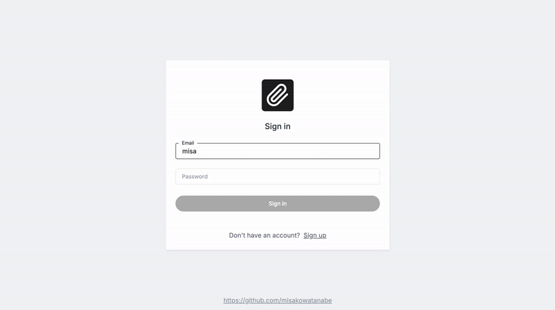

## Summary

A simple, easy-to-use task management app. It allows users to organize their work and keep track of tasks by offering multiple ways, such as labels and its changeable list order.

## Demo

[https://todo-v2-ten.vercel.app/signin](https://todo-v2-ten.vercel.app/signin)

## Tech Stack

| Area               | Technology                                                         |
| ------------------ | ------------------------------------------------------------------ |
| Frontend           | `Next.js (React)` `Storybook` `Tailwind` `Husky`                   |
| Backend            | `Firebase Firestore` `Firebase Authentication`                     |
| Testing            | `Jest` `Cypress` `Testing Library` `Firebase Local Emulator Suite` |
| Hosting            | `Vercel`                                                           |
| Language           | `Typescript`                                                       |
| UI Design          | `Figma`                                                            |
| Project Management | `Trello`                                                           |

## Features

- User authentication with email and password using Firebase Authentication.
- Retrieval of todos data and real-time update of the todos, labels and the order of todos with Firebase Firestore.
- Performance optimization and enhanced data security by introducing server-side rendering when possible using Next.js (App Router).
- Improved UX and lower security risk through Firebase Authentication and session cookies. It reduces the amount of user’s sign in process by checking a user's auth status. It also creates a session cookie when a user signs in, which will expire in 24 hours unless it gets deleted manually. The user will forcefully be logged out once the cookie expired/got deleted for better security.
- Routes protection using Middleware in Next.js. It checks user’s sign in status based on their session cookies before granting access to any app views, and redirect the user to the sign in view unless the user is signed in, and vice-versa.
- Stronger security through re-authentication before security-sensitive actions, such as changing email address and deleting account, unless a user has recently signed in.
- Giving users more control of personal data by providing a capability to delete their entire account information and all associated personal data.
- Rigorous end-to-end testing with Cypress, Testing Library and Firebase Local Emulator Suite. The E2E tests use the emulator on a test environment to mock a full capability of real authentication and database, which enables the tests to run on the same setting as a production environment without any possibility to harm the production.
- Deployment of the app with Vercel. Environment variables are safely set in the Vercel with sensitive flags.
- Pre-commit hook ensuring code quality and consistency using Husky.
- Global state management using Context API from React. The managed contents include user authentication, user’s todos, labels and the order of todos.
- Responsive design implemented from mobile to desktop view.
- Fully customizable UI component library of 15+ components (atom to organism levels from the atomic design methodology) using Tailwind. No external component library is used to reduce dependency and unexpected behavior.
- Robust visual tests implemented for each UI component with Storybook for better stability and maintainability.
- Enhanced accessibility by introducing keyboard navigation/shortcut and focus ring ([`:focus-visible`](https://developer.mozilla.org/en-US/docs/Web/CSS/:focus-visible)) in the UI components, and by following recommendations outlined in WCAG 2.0 as much as possible in color contrast, text size, page layout etc.
- UI components design and each view’s layout on Figma to achieve the same look and feel across the app.
